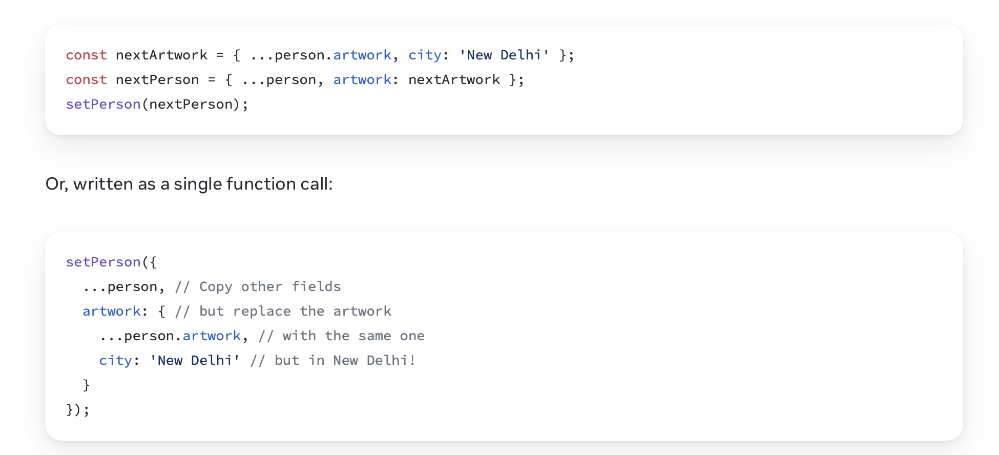

# Adding Interactivity (contd.)

## [Render and Commit](https://react.dev/learn/render-and-commit)
*Note: the restaurant metaphor is not very useful*

**What to understand**
- Change of state in a component triggers a component re-render
- Besides the re-rendered component, all it's children will also be re-rendered

- Rendering is logical 
	- react has a virtual DOM that it updates 
	- then updates the real DOM only in those parts where this is necessary


## [State as a Snapshot](https://react.dev/learn/state-as-a-snapshot)
*Note: the snapshot metaphor is not find very useful*

**What to understand**
- “Rendering” means that React is calling your component, which is a function. 
	- JSX returned from function a *snapshot of the UI in time*
	- Its props, event handlers, and local variables were all calculated using its state at the time of the render

- The state is not changed immediately after you call the setter, but later when React does all the state changes. 


Play with the [example](https://react.dev/learn/state-as-a-snapshot#state-over-time)!


## [Queueing A Series of State Updates](https://react.dev/learn/queueing-a-series-of-state-updates)

**What to understand**
- Updater Functions = powerful concept, seldom needed
- Setting state does not change the variable in the existing render, but it will be changed in the  new render


## [Updating Objects in State](https://react.dev/learn/updating-objects-in-state)

Modifying an object is called **mutating an object**.

**What to understand**
- you don't mutate state objects in React because react does not *see* that
- modifying objects is *easiest* with the *spread syntax*: 
	
- updating nested objects is ... a little bit ugly
	


## [Updating Arrays in State](https://react.dev/learn/updating-arrays-in-state)

Use spread syntax to create a copy of an array, e.g. `[...artists]`.


**What to understand**
- Once you have a copy, you can simply add elements at the end, e.g. 

```
setArtists( 
	[ 
		...artists, // that contains all the old items  
		{ id: nextId++, name: name } // and one new item at the end  	
	]  
);
```

- Removing an element from an array: `filter` or `slice` (never use `splice` -- that one mutates the object)

```
setArtists([  
	{ id: nextId++, name: name },  
	...artists // Put old items at the end  
]);
```


- Replacing an element in the array can be done with `map` 
	- map = one of the most important functions in functional programming 
	- Google invented a whole new big data processing around it named MapReduce

```
  function handleClick() {
    const nextShapes = shapes.map(shape => {
      if (shape.type === 'square') {
        return shape;
      } else {
        return {
          ...shape,
          y: shape.y + 50,
        };
      }
    });
    setShapes(nextShapes);
  }
```
 ( [example](https://codesandbox.io/s/s4vvyz?file=%2FApp.js&utm_medium=sandpack))

- Inserting an element  can be done with two uses of `slice`: 

```
  function handleClick() {
    const insertAt = 1; // Could be any index
    const nextArtists = [
      
      // Items before the insertion point:
      ...artists.slice(0, insertAt),
      
      // New item:
      { id: nextId++, name: name },
      
      // Items after the insertion point:
      ...artists.slice(insertAt)
    ];
    setArtists(nextArtists);
    setName('');
  }

```

- Sorting, reversing - `reverse`, `sort` -- they mutate the array. But it's ok if you copy the array first, and then mutate it the way you like


# Managing State

## [Reacting to Input with State](https://react.dev/learn/reacting-to-input-with-state)
*Note: seems to me to me to be needlessly theoretical*

To Understand
- How declarative UI programming differs from imperative UI programming
- How to model multiple states of a component
	- have a state variable
	- represent it with useState
	- render different states in terms of that
	- do not use redundant state variables (the whole discussion in Remove non-essential variables)

[Example](https://codesandbox.io/s/wnphcd?file=%2FApp.js&utm_medium=sandpack) of multiple states for a component. 
- note the Promise in the example! what does it do?

```
return new Promise((resolve, reject) => {

	setTimeout(() => {
		let shouldError = answer.toLowerCase() !== 'lima'
		if (shouldError) {
			reject(new Error('Good guess but a wrong answer. Try again!'));
		} else {
			resolve();
		}
	}, 1500);

});
```

Nice [Example](https://codesandbox.io/s/dg3sry?file=%2FApp.js&utm_medium=sandpack) of how to show all the possible states of a component at once.


# Thinking in React
https://react.dev/learn/thinking-in-react


**Step 0: Start from a mock and a data model**

Imagine the following UI:


A possible data model for it would be: 

```
[  
{ category: "Fruits", price: "$1", stocked: true, name: "Apple" },  
{ category: "Fruits", price: "$1", stocked: true, name: "Dragonfruit" },  
{ category: "Fruits", price: "$2", stocked: false, name: "Passionfruit" },  
{ category: "Vegetables", price: "$2", stocked: true, name: "Spinach" },  
{ category: "Vegetables", price: "$4", stocked: false, name: "Pumpkin" },  
{ category: "Vegetables", price: "$1", stocked: true, name: "Peas" }]
```


**Step 1: Break The UI Into A Component Hierarchy**


**Step 2: Build A Static Version in React**

- Start from the data model and renders the UI without interactivity
- Don't worry about the state even
- Pass the data as props


**Step 3: Identify The Minimal (but complete) Representation Of UI State**

- Does it remain unchanged over time? If so, it isn’t state.
- Is it passed in from a parent via props? If so, it isn’t state.
- Can you compute it based on existing state or props in your component? If so, it definitely isn’t state!


**Step 4: Identify Where Your State Should Live**

For each piece of state in your application:

1. **Identify _every_ component that renders something based on that state**.
2. **Find their closest common parent component**—a component above them all in the hierarchy.
3. Decide where the state should live:
    1. **Often, you can put the state directly into their common parent**.
    2. You can also put the state into some component above their common parent.
    3. If you can’t find a component where it makes sense to own the state, create a new component solely for holding the state and add it somewhere in the hierarchy above the common parent component.


**Step 5: Add Inverse Data Flow**

You will **often** have to pass state setters down the component hierarchy, and update the state from the children components

# Exercises

**Exercise**: Try the Live Challenge 2: Profile Editor from [Reacting to Input with State](https://react.dev/learn/reacting-to-input-with-state). Everybody should be able to do this. Implement a profile editor that has two states, as seen below. 


Start from the JSX snippet. 

```
export default function EditProfile() {
  return (
    <form>
      <label>
        First name:{' '}
        <b>Jane</b>
        <input />
      </label>
      <label>
        Last name:{' '}
        <b>Jacobs</b>
        <input />
      </label>
      <button type="submit">
        Edit Profile
      </button>
      <p><i>Hello, Jane Jacobs!</i></p>
    </form>
  );
}


```

