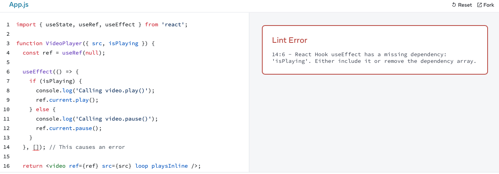

# [Effects](https://react.dev/learn/synchronizing-with-effects#step-1-declare-an-effect)

Two types of logic inside React components:
1. **Rendering code** => a transformation from props & state into JSX 
2. **Event handlers** => functions that do things -- change state, submit HTTP POST request, navigate to another screen, interact directly with the DOM (e.g. change page title)

When is this not sufficient?

*Example*: 
- When a ChatRoom component must connect to the server to download the corresponding info
- When you want to change the title of the page based on some info that the component knows
- When you want to save something to local storage... 

Every time when, as a side effect of changing state... you want to do something else than re-render. 


**Side Effects in React = actions that a functional component does besides rendering the component.**

- Effects let you run some code after rendering so that you can synchronize your component with some system outside of React


In general
- effects in React are directly caused by the rendering
- thus, they are called at the end of a commit, **after the screen updates**
- after every rendering
- why is this a good time to sync components with external systems? 

Three steps to define an effect?
#### 1. Declare it: `import { useEffect } from 'react';`

- `useEffect` is a React Hook that lets you [synchronize a component with an external system.](https://react.dev/learn/synchronizing-with-effects) 


```javascript
function MyComponent() {  

	useEffect(() => {  
		console.log("every render!")
	});  
	return <div />;  
}
```

**Every time the component renders, React updates the screen and then runs the code inside useEffect.** 

Interesting example: [controlling a video player component](https://react.dev/learn/synchronizing-with-effects#step-1-declare-an-effect) with an effect
- you need to interact with the DOM
- get a reference to the relevant DOM element
- call the `start` and `stop` methods 

#### 2. Specify the Effect dependencies 

Observe in the example: 
- adding the empty dependencies array `[]` as a second argument to `useEffect` results in an error


- adding `isPlaying` as second argument fixes the problem


### 3. Add cleanup if needed 

- If your effect allocates a resource that can be deallocated, do that by returning a *cleanup function*
- Pay attention at the syntax it's **an arrow function that does the connection, and then returns another function that does the disconnect** 
- Important: **If you call an effect with no dependencies, it is only run once, on mount!**


**Note:** During development, React runs the useEffect twice on mount
Why? if your code works in this situation, it means you're cleaning up nicely; and that's good!


# React Hooks 

Special React functions for "hooking into" the framework
- their name starts with `use`
- called at the top of the component
- can be called from another hook or directly from a component
- can't be called from within a conditional expression or nested functions


Most Popular
- useState -- to allow you to define state
- useEffect -- to allow you to handle side effects
- useRef -- an object that can be persisted across renderings but is not state


## [Using `useRef` for manipulating DOM elements](https://react.dev/learn/manipulating-the-dom-with-refs)

Sometimes you want to manipulate the DOM in ways that React does not help you to. E.g. 
- ***automatically focusing a given element*** when a component is first time rendered.  
- scrolling to a given node
- getting the dimensions of a given DOM node


The `useRef` hook returns an object with one property: `current`. 
It is persisted between renders. 


Example of automatically focusing a given element on first render: 
1. import `useRef`
2. declare a ref object (i.e. `inputRef`)
3. pass your object as the `ref` attribute to the desired DOM element

```javascript
import {useRef, useEffect} from 'react'

const InputRefExample = () => {

  const inputRef = useRef(null);
  
  useEffect(() => {
    inputRef.current.focus()
  }, [])
  
  return(
    <div>
      <input ref={inputRef} />
      <button onClick = {() => inputRef.current.focus()}>Submit</button>
    </div>
  )
}
export default inputRefExample
```


